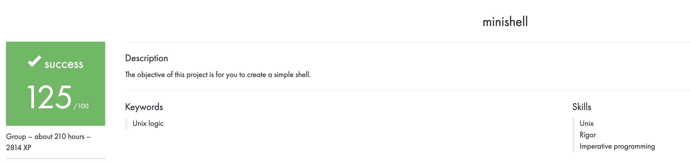

# minishell_42

### Group project:
```
hzona(https://github.com/maminparen/)
cdarrell(https://github.com/CroWcbr/)
```

The second project of the Unix branch at 42. Basic requirements are to recreate a basic working shell, with a few required builtins. History was implemented as a bonus builtin. Enviromental variables need to be set up and maintained. In the event that a command is input that is not a builtin, an attempt is made to execute it as is, followed by checking all paths for a valid matching executable.

### Builtins Implemented

```
cd
echo
env
exit
history
setenv
unsetenv
```

### Possible Optimization

The official ls on macs, at the time of this writing, utilizes 38 flags. Adding more flags for a more complete recreation would be the next step.

## Usage

### Compilation

Compiler:

```
clang-6.0
```

Dependencies:

```
libft
readline
```

### Execution

How to run:

```
./minishell
```

## Example

```
./minishell
minishell > echo "Hello"
Hello
minishell >
```
